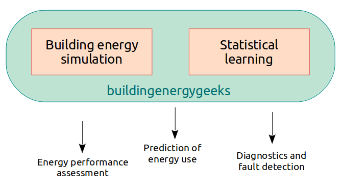

Welcome to the home page of BuildingEnergyGeeks!

This website is a series of tutorials that aim at bringing together building energy simulation and statistical learning.

The increasing availability of data opens a lot of possibilities to improve the energy performance of the building stock: assessing the impact of energy conservation measures; characterising the envelope to decide for the best retrofitting solutions; train predictive models for optimal HVAC control; fault detection, etc.

On one hand, engineers and researchers in charge of ensuring building energy performance often lack the statistical tools to fully use the potential of monitoring data. One the other hand, data scientists, who have expertise on statistical modelling, could benefit from including some physical meaning into their models. These two audiences however seem to have little overlap, which motivated the creation of this website.

This website is made of three categories that you can find on the menu:
* [Data analysis](/index_data.html) is a series of notebooks showing what knowledge can be gained from records of energy consumption, weather data, ambient measurements...
* [The handbook of heat transfer in buildings](/index_hhtb.html) (which I have not started writing yet) will be a course on heat transfer modelling and energy performance assessment of buildings.
* [EBE clim](/index_ebe.html) is a website (in French) I originally made for my students at [USMB](https://www.univ-smb.fr/), on heat transfer in buildings and HVAC systems.

You can also read more about the author [here](/about.html), and join the [forum](http://discourse.buildingenergygeeks.org/) for further discussion and suggestions.
